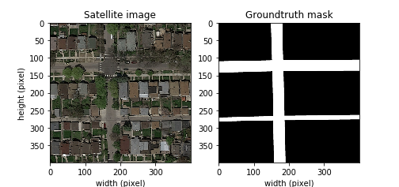

# Road Segmentation ML Project 2019
##### Emilio Fernández, Tyler Benkley, Frédéric Berdoz

This project presents and explores three different machine learning approaches in order to perform an image segmentation task on satellite images for distinguishing the road. In other words, a binary classifier is implemented in three different ways (Logistic Regression, Convolutional Neural Network and U-net Neural Netwrok) so that it labels each pixel as road or background. 

The dataset was downloaded from [AICrowd Road Segmentation Challenge](https://www.aicrowd.com/challenges/epfl-ml-road-segmentation-2019/) and our best machine learning approach (U-net neural network) achieved a F1 score of 0.9, which shows the potential of deep learning techniques for image segmentation. We have detailed all of our findings in a 4-page [report](Road_Segmentation_Challenge.pdf)

### Description of the files

We have implemented three models on different Jupyter notebooks and a final script that loads directly the best model :
+ `LogisticRegression.ipynb`: Classifier based on regularized logistic regression. 
+ `CNN.ipnyb`: Classifier based on basic convolutional neural network.
+ `UNet.ipnyb`: Clasiffier based on U-net neural network.
+ `modelUNET.h5`: The model we trained that gave the best performance.
+ `run.py`:  Script that directly loads the U-net model from `modelUNET.h5` and performs classification on the test set. If one wants to train the model instead of loading it, the TRAIN variable in the `run.py` file can be set to True. By default, it is set to False.

There are also the following folders:
+ `Experimentation`: Contains several notebooks where we tried different models and parameters
+ `Datasets`: Cointains the training and the testing data (must be downloaded from [AICrowd](https://www.aicrowd.com/challenges/epfl-ml-road-segmentation-2019/dataset_files))
+ `Predictions`: Contains the predicted masks (empty before running)
+ `Submissions`: Contains subfolders (named after the hour/date they were created) and these subfolders cointain the submission file as well as the model that resulted in this submission. A new subfolder is created each time a submission is created, except for le logistic regression submission, for which only the submission file is saved (empty before running)
+ `Checkpoints`: Contains the checkpoints of the model that is being trained, for safe keeping (empty before running)

### Setup

The model has been trained using Google Colab, a similar environment to Jupyter-Lab, but providing a free Tesla K80 GPU to run on the cloud, which accelerates substantially the model training. Python 3 must be installed in order to run this code.
Additionally, the following external libraries must be installed to run the project:
- Keras (running on top of TensorFlow version 1.14 and above): deep learning library used for designing our neural networks
- OpenCV: Computer vision library used for image feature extraction.

### How to run

The steps to run the code are the following:
1) Download the project folder
2) Place the datasets in the Datasets folder (if not there already) 
3) Set the current directory in this folder with the terminal
4) Type the command "python run.py"
